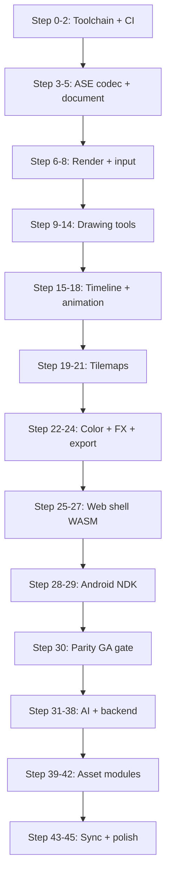

# PixelForge — Step-by-Step Build Guide

**Purpose:** Generate PixelForge incrementally from the docs in `docs/`, with a verification gate after every step so nothing ships broken.

**Baseline:** Aseprite v1.3.17.x · **174 P0 parity items** · Web WASM + Android NDK  
**Current repo state:** Step 2 complete — document model; Step 3 next (ASE read)

---

## How to use this guide

1. Complete steps **in order** — later steps assume earlier gates passed.
2. After each step, run its **Verification gate** before continuing.
3. Track parity rows in [`specs/aseprite-parity-matrix.json`](specs/aseprite-parity-matrix.json).
4. One Cursor/agent session = **one step** (or one sub-step for large items).
5. If a gate fails, fix before advancing — do not skip.

### Global commands (every step)

```bash
cargo build -p pixelforge-core
cargo test -p pixelforge-core
python tests/parity/run_parity.py --summary
```

---

## Architecture map (build order)



---

## Phase 0 — Editor core (Aseprite parity)

### Step 0 — Development foundation

| | |
|---|---|
| **Goal** | Reproducible dev environment on MAZAYA-STUDIO + CI |
| **Docs** | [editor-architecture](decisions/editor-architecture.md), [platform-architecture](decisions/platform-architecture.md) |

**Tasks**
- [x] Rust stable + `wasm32-unknown-unknown` target installed
- [x] Android NDK + `aarch64-linux-android` target (for Step 28)
- [x] GitHub Actions: `cargo build`, `cargo test`, `run_parity.py --summary`
- [x] Pin Aseprite v1.3.17.x on MAZAYA-STUDIO for golden generation

**Note:** NDK linker config + NDK CI job deferred to Step 28. See `.cargo/config.toml.example` and [ASEPRITE_BASELINE.md](../tests/parity/ASEPRITE_BASELINE.md).

**Verification gate**
```bash
rustup show
rustup target list --installed | findstr wasm32
cargo build -p pixelforge-core
```

---

### Step 1 — Parity fixture pipeline

| | |
|---|---|
| **Goal** | 50+ `.aseprite` fixtures + golden PNGs from desktop Aseprite |
| **Docs** | [parity matrix](specs/aseprite-parity-matrix.md) § Parity testing |
| **Matrix** | IO-01, RT fixtures |

**Tasks**
- [x] Export fixtures from Aseprite: blank, indexed, RGB, tags, linked cels, tilemap, slices
- [x] Store in `tests/parity/fixtures/` (manifest-driven, 55 entries)
- [x] Generate goldens via Aseprite CLI → `tests/parity/golden/`
- [x] Extend `generate_fixtures.rs` for synthetic blanks per size/mode
- [x] Map each fixture to matrix IDs in `run_parity.py` via `fixtures/manifest.json`

**Note:** Full round-trip parity for complex (Lua) fixtures deferred to Steps 3–4; Step 1 uses `read_smoke` for `aseprite-lua` sources.

**Verification gate**
```powershell
.\scripts\bootstrap-parity-fixtures.ps1
# or on CI (no Aseprite): generate_fixtures + --fixture-count
python tests/parity/run_parity.py --list-cases
python tests/parity/run_parity.py --fixture-count  # Expect ≥50
```

---

### Step 2 — Document model (complete)

| | |
|---|---|
| **Goal** | In-memory sprite model matching Aseprite semantics |
| **Docs** | [parity matrix](specs/aseprite-parity-matrix.md) §4 Document |
| **Matrix** | DOC-01 … DOC-14 |

**Tasks**
- [x] `SpriteDocument`: pixels per cel (RGBA + indexed), palette, layers, groups
- [x] `LayerKind`: Normal, Group, Tilemap, Reference with correct constraints
- [x] `Cel`: position, opacity, z-index per frame, linked-cel graph
- [x] `FrameTag`, slices, tileset refs, user data blob
- [x] Unit tests: create, mutate, serialize to JSON snapshot

**Note:** ASE `read_ase` / `write_ase` still bootstrap-level; full chunk mapping in Steps 3–4.

**Verification gate**
```bash
cargo test -p pixelforge-core document::
cargo test -p pixelforge-core ase::
```

---

### Step 3 — ASE read (full)

| | |
|---|---|
| **Goal** | Parse real `.aseprite` files into `SpriteDocument` |
| **Docs** | [round-trip spec](specs/aseprite-roundtrip.md), [ASE spec](https://github.com/aseprite/aseprite/blob/main/docs/ase-file-specs.md) |
| **Matrix** | IO-01 |

**Tasks**
- [ ] Header, frames, chunks: LAYER, CEL (raw/compressed/linked), PALETTE, TAG, SLICE, TILESET
- [ ] Indexed, RGB, Grayscale depth handling
- [ ] `read_ase()` round-trip read for all fixtures without panic
- [ ] Fuzz: reject corrupt files with `CoreError`, never UB

**Verification gate**
```bash
cargo run -p pixelforge-core --bin roundtrip -- tests/parity/fixtures/
# Read succeeds for all fixtures; log layer/frame/tag counts
```

---

### Step 4 — ASE write (full)

| | |
|---|---|
| **Goal** | Write `SpriteDocument` → bytes Aseprite can open |
| **Docs** | [round-trip spec](specs/aseprite-roundtrip.md) |
| **Matrix** | IO-01, SLC-*, TL-05…07 |

**Tasks**
- [ ] Symmetric write for all chunk types implemented in Step 3
- [ ] `write_ase()` + `roundtrip` binary: read → write → read structural equality
- [ ] Optional: byte-compare with Aseprite re-save (allow zlib variance)

**Verification gate**
```bash
cargo run -p pixelforge-core --bin roundtrip -- --write tests/parity/output/
# Open each output file in desktop Aseprite — no warnings
python tests/parity/run_parity.py --target wasm
# RT-* cases: pass or pending_impl only if golden diff tooling not wired yet
```

---

### Step 5 — Pixel buffer & palette engine

| | |
|---|---|
| **Goal** | Correct pixel ops for indexed/RGB, palette quantize |
| **Matrix** | COL-01…03, COL-12, DOC-02…03 |

**Tasks**
- [ ] `ImageBuffer`: get/set pixel, bounds, clip
- [ ] Palette: 256 entries, index↔RGBA, add missing color
- [ ] Color mode conversion with dithering matrices
- [ ] `postprocess.rs`: nearest downscale, quantize, despeckle (used in Phase 1 too)

**Verification gate**
```bash
cargo test -p pixelforge-core postprocess::
cargo test -p pixelforge-core palette::
```

---

### Step 6 — Renderer (CPU → GPU path)

| | |
|---|---|
| **Goal** | Integer zoom 50%–3200%, pixel-perfect canvas |
| **Matrix** | VIEW-03…04, VIEW-08, TOOL-24, FR-ED-3 |

**Tasks**
- [ ] `crates/pixelforge-core/src/render/`: composite layers → framebuffer
- [ ] Blend modes matching Aseprite order
- [ ] Integer scale, pan, checkerboard transparency
- [ ] WASM: expose framebuffer as RGBA bytes for WebGL texture upload

**Verification gate**
- [ ] Render blank_16x16 fixture → PNG matches golden at 100%, 800%, 3200%
- [ ] No fractional pixel scaling at any zoom level

---

### Step 7 — Undo / transaction system

| | |
|---|---|
| **Goal** | Non-linear undo matching editor mutations |
| **Matrix** | EDT-01…02, PRF-09…10 |

**Tasks**
- [ ] `Transaction` + command stack (draw, move cel, tag edit, …)
- [ ] Undo/redo with coalesced pencil strokes
- [ ] Configurable undo memory limit (MB)

**Verification gate**
```bash
cargo test -p pixelforge-core undo::
# 100 random ops → undo all → document equals initial snapshot
```

---

### Step 8 — Input & tool controller

| | |
|---|---|
| **Goal** | Pointer, keyboard, stylus event routing |
| **Matrix** | TOOL-QT-01…03, PLT-02…06 |

**Tasks**
- [ ] `InputState`: modifiers, tool quicktools (Alt/Ctrl/Space)
- [ ] Stylus: pressure, tilt (tablet), velocity
- [ ] Map keys to actions from Aseprite `gui.xml` subset (grow over Steps 9–14)

**Verification gate**
- [ ] Unit tests: modifier+click routes to correct tool behavior
- [ ] Tablet: log pressure curve on Advan stylus (manual QA checklist)

---

### Steps 9–14 — Drawing tools (24)

Build **one tool per sub-step**. Each sub-step follows the same pattern:

| Sub-step | Tool IDs | Matrix |
|----------|----------|--------|
| **9** | TOOL-01…05 Selection tools | Marquee, lasso, wand |
| **10** | TOOL-06…08 Pencil, spray, eraser | + INK-01…07, BRU-* |
| **11** | TOOL-09…11 Eyedropper, bucket, gradient | |
| **12** | TOOL-12…17 Line, curve, shapes | |
| **13** | TOOL-18…20 Blur, jumble, text | |
| **14** | TOOL-21…23 Hand, move, slice | |

**Per-tool checklist**
- [ ] Implement `Tool` trait: pointer down/move/up, cancel, cursor
- [ ] Match Aseprite behavior on dedicated fixture (pixel diff vs golden)
- [ ] Wire ink mode + brush params
- [ ] Mark matrix row `pass` in parity report

**Verification gate (each sub-step)**
```bash
cargo test -p pixelforge-core tools::<tool_name>
python tests/parity/run_parity.py --target wasm
# New OP-* cases pass for tools added in this sub-step
```

---

### Step 15 — Selection & transform

| | |
|---|---|
| **Matrix** | SEL-01…09, EDT-06…07 |

**Tasks**
- [ ] Floating selection, transform handles, skew (v1.3)
- [ ] RotSprite rotation + force-90 option
- [ ] Pivot numeric fields, snap-to-grid toggle
- [ ] Shift-wrap pixels in selection

**Verification gate**
- [ ] `rot_sprite.aseprite` fixture: OP-003 passes pixel diff

---

### Step 16 — Timeline UI model

| | |
|---|---|
| **Matrix** | TL-01…16 |

**Tasks**
- [ ] Frame grid state: add/remove/duplicate/reverse frames
- [ ] Tag CRUD: direction, repeat count, subtags, drag resize
- [ ] Cel drag-drop, linked cels, copy/paste between docs
- [ ] Onion skin settings (prev/next, tint)

**Verification gate**
- [ ] `tags_walk_cycle.aseprite` round-trip preserves all tag fields
- [ ] Playback order matches Aseprite for ping-pong + repeat

---

### Step 17 — Animation playback

| | |
|---|---|
| **Matrix** | TL-10…11, VIEW-07…08 |

**Tasks**
- [ ] Playback engine: Enter in editor, preview window
- [ ] Onion skin render pass
- [ ] Export frame timing for GIF/PNG seq

**Verification gate**
- [ ] 4-frame anim plays at correct ms per frame vs Aseprite

---

### Step 18 — Color bar, palette editor, adjustments

| | |
|---|---|
| **Matrix** | COL-01…14, EDT-05 |

**Tasks**
- [ ] Color bar fg/bg, swap, palette index display
- [ ] Palette editor F4: sort, resize, presets
- [ ] Replace color, B/C, H/S, curves, invert, FX outline/convolution/despeckle

**Verification gate**
- [ ] Replace-color fixture: pixel-identical to Aseprite golden

---

### Steps 19–21 — Tilemap system

| | |
|---|---|
| **Matrix** | MAP-01…12, DOC-09 |

| Sub-step | Focus |
|----------|--------|
| **19** | Tilemap layer + tileset data model, external tilesets |
| **20** | Draw pixels vs tiles; manual/auto/stack modes |
| **21** | Export tileset, CLI `--export-tileset` server job |

**Verification gate**
- [ ] `tilemap_manual.aseprite` round-trip: tile indices preserved
- [ ] MAP-* rows pass on web + tablet targets

---

### Step 22 — Slices & 9-patch

| | |
|---|---|
| **Matrix** | SLC-01…05, TOOL-23 |

**Tasks**
- [ ] Slice tool, named regions, 9-patch center, pivot
- [ ] Slice metadata in sprite sheet JSON export

**Verification gate**
- [ ] `slices_ninepatch.aseprite` round-trip lossless

---

### Step 23 — File import

| | |
|---|---|
| **Matrix** | IO-02…05 |

**Tasks**
- [ ] PNG, GIF, BMP, WebP, JPEG decode → new sprite/layer
- [ ] Image sequence import, sprite sheet import (Ctrl+I)
- [ ] Paste as new sprite

**Verification gate**
- [ ] Import sample PNG 32×32 → edit → export matches expected

---

### Step 24 — File export + server CLI

| | |
|---|---|
| **Matrix** | IO-06…12, MENU-01…08 |

**Tasks**
- [ ] Export As: GIF, PNG sequence, resize on export
- [ ] Sprite sheet + JSON (hash/array), trim, extrude, split-tags/slices
- [ ] `apps/api`: `POST /v1/assets/{id}/export` mirroring `aseprite -b` flags
- [ ] Repeat last export, pinned folders (v1.3.15)

**Verification gate**
```bash
# Compare API export output bytes to Aseprite CLI golden
python tests/parity/run_parity.py --target wasm
# EX-001 passes
```

---

### Step 25 — Web app shell (WASM)

| | |
|---|---|
| **Docs** | [platform-architecture](decisions/platform-architecture.md), [editor-architecture](decisions/editor-architecture.md) |
| **Matrix** | PLT-01, MENU-*, PRF-* |

**Tasks**
- [ ] `apps/web`: Vite + React/Svelte, load `pixelforge_core.wasm`
- [ ] Canvas WebGL blit from core framebuffer
- [ ] Layout: tools left, color right, timeline bottom (per PRD)
- [ ] Menus, preferences panels, keyboard shortcut map
- [ ] Run Command (Ctrl+Space) search

**Verification gate**
- [ ] Open `blank_16x16.aseprite` in browser, pencil stroke, save, round-trip
- [ ] Cold start &lt;2s for 64×64 sprite (Chrome)

---

### Step 26 — Web integration tests

| | |
|---|---|
| **Goal** | E2E parity on WASM target |

**Tasks**
- [ ] Playwright: open app, draw, undo, export PNG
- [ ] `run_parity.py --target wasm` drives headless WASM via Node binding

**Verification gate**
```bash
python tests/parity/run_parity.py --target wasm
# ≥95% P0 matrix items pass (PRD §9)
```

---

### Step 27 — Preferences, themes, session recovery

| | |
|---|---|
| **Matrix** | PRF-01…10, U04 |

**Tasks**
- [ ] All preference panels from Aseprite prefs docs
- [ ] Light/dark theme, custom theme load
- [ ] Session recovery on crash, undo history UI

**Verification gate**
- [ ] Kill tab mid-edit → reopen → recovery prompt with correct state

---

### Step 28 — Android NDK core

| | |
|---|---|
| **Docs** | [advan-tablet-qa](decisions/advan-tablet-qa.md) |
| **Matrix** | PLT-02…07 |

**Tasks**
- [ ] `pixelforge-core` builds as `cdylib` for `aarch64-linux-android`
- [ ] JNI bridge: init, load sprite, pointer events, render buffer
- [ ] `apps/android`: Kotlin Compose shell, tablet-only manifest (`smallestWidthDp=600`)

**Verification gate**
```bash
python tests/parity/run_parity.py --target ndk --device 1029P002505S070810
adb install app-debug.apk
# Pencil latency <16ms on Advan (manual trace)
```

---

### Step 29 — Android UX (touch-native)

| | |
|---|---|
| **Matrix** | PLT-04…06, MENU-* |

**Tasks**
- [ ] Long-press tool submenus, timeline touch drag, pinch zoom preview
- [ ] BT keyboard → full shortcut map
- [ ] Phone gate: show "tablet required" if &lt;600dp

**Verification gate**
- [ ] All PLT-* rows pass on Advan Sketsa 3 checklist

---

### Step 30 — Phase 0 GA gate

| | |
|---|---|
| **Docs** | [PRD](PRD.md) §9 Success metrics |

**Checklist**
- [ ] ≥95% of 171 P0 parity matrix rows = `pass` (web + tablet)
- [ ] 50+ fixtures with goldens
- [ ] Documented exceptions only for P1 items (VIEW-11, PRF-11, PRF-12)
- [ ] Round-trip spec §5 checklist all green
- [ ] Advan: cold start &lt;2s, 3200% zoom no freeze, RAM &lt;4GB

**Do not start Phase 1 until this gate passes.**

---

## Phase 1 — AI generation core

### Step 31 — MAZAYA-STUDIO AI stack

| | |
|---|---|
| **Docs** | [ai-pc-setup](decisions/ai-pc-setup.md), [generation-pipeline](decisions/generation-pipeline.md), `infra/ai/README.md` |

**Tasks**
- [ ] ComfyUI portable + DirectML in `infra/ai/ComfyUI/`
- [ ] `pixel_dream_v1.0.safetensors` in checkpoints
- [ ] Wire workflow JSON node links; re-export API format
- [ ] `run_directml.bat` + Tailscale expose `:8188`
- [ ] `python infra/ai/benchmark.py` → &lt;60s for 512×512

**Verification gate**
```bash
python infra/ai/benchmark.py
curl http://100.89.170.66:11434/api/tags
# Ollama models listed; ComfyUI PASS or SLOW with elapsed logged
```

---

### Step 32 — Backend API (production)

| | |
|---|---|
| **Docs** | [v1-scope](decisions/v1-scope.md), [PRD](PRD.md) §5.3 |

**Tasks**
- [ ] Postgres schema: users, projects, assets, versions, jobs
- [ ] S3-compatible storage for `.aseprite` + `meta.json`
- [ ] `GET /health/ai` → Ollama + ComfyUI status (30s poll from clients)
- [ ] JWT magic-link auth (optional) + anonymous local mode
- [ ] Docker Compose for homelab deploy

**Verification gate**
```bash
curl localhost:3000/health/ai
# Returns { ollama: ok, comfyui: ok|offline }
```

---

### Step 33 — AI job pipeline

| | |
|---|---|
| **Docs** | [generation-pipeline](decisions/generation-pipeline.md) |
| **Matrix** | AI-01…08 |

**Tasks**
- [ ] `POST /v1/jobs/generate`: text→spec (Ollama) → image (ComfyUI) → postprocess
- [ ] img2img path for JPG/PNG/WebP (denoise 0.35–0.55)
- [ ] SSE/WebSocket progress events
- [ ] Insert result as layer/cel + optional reference layer
- [ ] `meta.json` generationHistory entry with seed/params

**Verification gate**
- [ ] Text prompt → 32×32 sprite in &lt;90s end-to-end
- [ ] JPG upload → 32×32 with project palette, 4 variants

---

### Step 34 — Fast quantize (offline)

| | |
|---|---|
| **Matrix** | AI-08, US-1.5, FR-IMG-3 |

**Tasks**
- [ ] WASM/NDK `postprocess` without ComfyUI
- [ ] UI: "Fast quantize" when `health/ai` reports offline
- [ ] Persistent banner: *"AI unavailable — MAZAYA-STUDIO is offline"*

**Verification gate**
- [ ] Stop ComfyUI → convert PNG → quantized sprite still works
- [ ] Editor fully usable; AI buttons disabled with tooltip

---

### Step 35 — Inpaint + sketch-to-pixel

| | |
|---|---|
| **Matrix** | AI-03…04, US-1.3…1.4 |

**Tasks**
- [ ] Export active cel/selection as mask + source image
- [ ] ComfyUI inpaint workflow
- [ ] Sketch layer → img2img from editor

**Verification gate**
- [ ] Inpaint selected 8×8 region; surrounding pixels unchanged (pixel diff)

---

### Step 36 — Project palette & style bible

| | |
|---|---|
| **Docs** | [module-priority](decisions/module-priority.md), [v1-scope](decisions/v1-scope.md) |
| **Matrix** | AI-05…06, US-3.3 |

**Tasks**
- [ ] `project.json`: palette, style bible, reference board URLs
- [ ] Enforce palette in postprocess; consistency checker (flag drift)
- [ ] UI: project settings panel

**Verification gate**
- [ ] Generate with locked palette → 0 colors outside project palette

---

### Step 37 — AI UI in web + tablet

| | |
|---|---|
| **Docs** | [PRD](PRD.md) Epic 1 |

**Tasks**
- [ ] Collapsible AI drawer (tablet landscape default)
- [ ] Photo-to-pixel wizard: size, palette, denoise, dither, 4-variant gallery
- [ ] Generation history panel + restore variant

**Verification gate**
- [ ] Complete US-1.1…1.6 user stories manually on web + Advan

---

### Step 38 — Phase 1 GA gate

- [ ] All AI-01…08 matrix rows pass
- [ ] PC-offline banner 100% reliable (PRD §9)
- [ ] JPG→32×32 &lt;90s; 512×512 ComfyUI &lt;60s on RX 5600 XT

---

## Phase 2 — Asset workflows

Per [module-priority](decisions/module-priority.md):

| Step | Module | Key deliverables |
|------|--------|------------------|
| **39** | Sprites | Pivot/collision in `meta.json`, direction-set prep |
| **40** | Icons/UI | 8–32px presets, 9-slice gen, button state sets |
| **41** | Tilesets | Seam validator, Wang/autotile 16-set, test-map painter |
| **42** | Illustrations | 64–128px presets, background removal |

**Verification gate**
- [ ] Module success criteria table in module-priority.md all met

---

## Phase 3 — Sync, collaboration, polish

| Step | Focus | Docs |
|------|--------|------|
| **43** | Offline outbox + LWW sync + merge UI | [v1-scope](decisions/v1-scope.md) |
| **44** | Aseprite external edit + watch folder | [round-trip spec](specs/aseprite-roundtrip.md) |
| **45** | Engine export packs (Godot/Unity), batch jobs, collections | [PRD](PRD.md) Epic 4 |

**Verification gate**
- [ ] Tablet offline edit → reconnect → outbox drains without data loss
- [ ] Edit in desktop Aseprite → watch re-import → `meta.json` AI history preserved

---

## Error prevention rules

| Rule | Why |
|------|-----|
| **Never skip a verification gate** | Parity bugs compound — a wrong pencil at Step 10 breaks every later tool |
| **One source of truth for pixels** | All drawing goes through `pixelforge-core`; UI shells do not paint directly |
| **Fixture before feature** | Add Aseprite golden before implementing each tool |
| **Same tests on WASM + NDK** | `run_parity.py` must pass on both targets before Step 30 |
| **AI depends on editor** | Do not wire ComfyUI output until Step 4 ASE write can insert layers |
| **Pin versions** | Aseprite 1.3.17.x, pixel_dream v1.0, Ollama model tags in `.env` |
| **No cloud AI** | Reject any dependency that phones home for generation (PRD non-goals) |

---

## Session prompt template (for Cursor)

Copy into a new agent session to execute one step:

```
Project: PixelForge (C:\Users\mazay\Projects\pixelforge)
Execute: Step N from docs/BUILD-STEPS.md only.
Before coding: read the step's linked docs and matrix IDs.
After coding: run the step's Verification gate and report pass/fail.
Do not start Step N+1.
```

---

## Related documents

| Document | Role |
|----------|------|
| [PRD.md](PRD.md) | Requirements, user stories, success metrics |
| [specs/aseprite-parity-matrix.md](specs/aseprite-parity-matrix.md) | 174 feature checklist |
| [specs/aseprite-roundtrip.md](specs/aseprite-roundtrip.md) | `.aseprite` + `meta.json` interchange |
| [decisions/module-priority.md](decisions/module-priority.md) | Phase 2 asset order |
| [decisions/generation-pipeline.md](decisions/generation-pipeline.md) | AI stack |
| [decisions/v1-scope.md](decisions/v1-scope.md) | Auth, sync, scope |

---

## Progress tracker

Update this table as you complete steps:

| Step | Name | Status | Date |
|------|------|--------|------|
| 0 | Dev foundation | ☑ | 2026-06-18 |
| 1 | Parity fixtures | ☑ | 2026-06-18 |
| 2 | Document model | ☑ | 2026-06-18 |
| 3 | ASE read | ◐ | header only |
| 4 | ASE write | ◐ | indexed blank |
| 5–45 | … | ☐ | |

**Legend:** ☐ not started · ◐ in progress · ☑ gate passed
