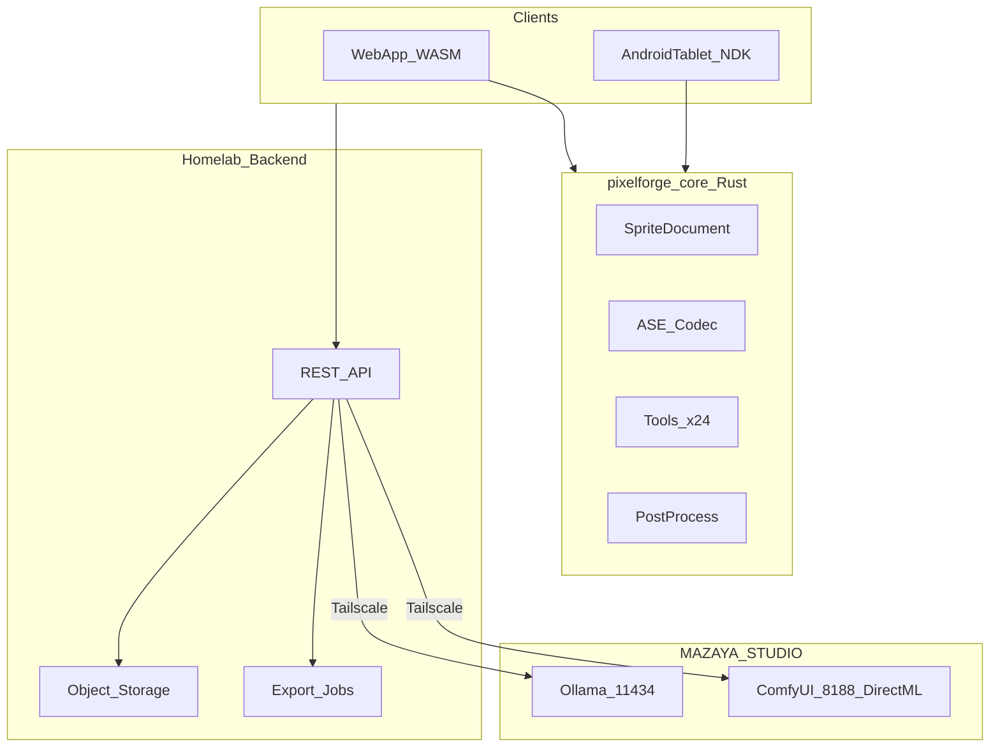

# Product Requirements Document — PixelForge

**Version:** 1.0  
**Date:** 2026-06-18  
**Status:** Draft for engineering kickoff  
**Owner:** Personal / MAZAYA-STUDIO  
**Codename:** PixelForge

---

## 1. Executive summary

PixelForge is an **AI-native pixel art studio** for **web** and **Android tablet** that delivers **100% Aseprite v1.3.17.x editor parity** plus **local-only AI generation** on the user's PC (**MAZAYA-STUDIO**). It is not a generic image generator with a pixel filter — the editor is the foundation; AI accelerates asset creation on top.

**Problem:** Indie developers and pixel artists want Aseprite-class tooling on tablet and browser, plus AI that respects palettes and pixel constraints — without sending art to cloud APIs.

**Solution:** Shared **Rust editor core** (WASM + Android NDK), homelab **app backend** for sync, and **Ollama + ComfyUI (pixel_dream v1.0)** on MAZAYA-STUDIO over Tailscale.

**Target:** Phase 0 parity core → Phase 1 AI (text→pixel, JPG/PNG→pixel) → Phase 2 asset workflows. QA baseline: **Advan Tab Sketsa 3**.

---

## 2. Goals & non-goals

### 2.1 Goals

1. **Full Aseprite parity** on web and Android tablet (tools, timeline, tilemaps, export, scripting subset)
2. **Local AI only** — Ollama LLM + ComfyUI image gen on MAZAYA-STUDIO
3. **JPG/PNG/WebP → pixel art** as a first-class P0 conversion flow
4. **Graceful PC-offline mode** — editor always works; AI disabled with clear banner
5. **Lossless `.aseprite` round-trip** with optional desktop Aseprite external edit
6. **Project-level style** — palette lock, style bible, reference board, generation history

### 2.2 Non-goals (v1)

- Android phone app (tablet-only)
- iOS or desktop native app
- Cloud AI APIs (OpenAI, Midjourney, etc.)
- Partial / "good enough" editor
- 3D-to-pixel, video-to-pixel
- Public marketplace or monetization infrastructure

---

## 3. Users & personas

### Persona 1 — Indie game developer (primary, web)

- **Needs:** Fast sprites, tilesets, UI icons; engine export; pipeline-friendly CLI
- **Success:** Photo → 32×32 sprite in one session; exports atlas + JSON for Godot/Unity

### Persona 2 — Pixel artist (primary, tablet)

- **Needs:** Stylus drawing, animation timeline on couch; sync to desktop later
- **Success:** Full tool parity on Advan tablet; &lt;16ms stroke latency; offline edit on trip

### Persona 3 — Solo creator / owner (admin)

- **Needs:** Local AI on own hardware; no subscription; project organization
- **Success:** MAZAYA-STUDIO powers gen; app works when PC is off

---

## 4. User stories (v1)

### Epic 1 — Generate (AI)

| ID | Story | Priority |
|----|-------|----------|
| US-1.1 | As a user, I upload a JPG/PNG and convert it to 32×32 pixel art with my project palette | P0 |
| US-1.2 | As a user, I describe a 16×16 icon in text and get 4 variants to choose from | P0 |
| US-1.3 | As a user, I sketch on a cel and regenerate it as polished pixel art | P0 |
| US-1.4 | As a user, I inpaint a selected region without regenerating the whole sprite | P0 |
| US-1.5 | As a user, I use fast quantize when MAZAYA-STUDIO is offline | P0 |
| US-1.6 | As a user, I see a banner when AI is unavailable and can still edit | P0 |
| US-1.7 | As a user, I batch-generate 8 icon variants with locked palette | P1 |

### Epic 2 — Edit (Aseprite parity)

| ID | Story | Priority |
|----|-------|----------|
| US-2.1 | As a user, I open any `.aseprite` file without missing layers/tags/tilemaps | P0 |
| US-2.2 | As a user, I animate with tags, onion skin, and linked cels | P0 |
| US-2.3 | As a user, I paint with all 24 tools and 7 ink modes | P0 |
| US-2.4 | As a user, I edit tilemap layers in manual/auto/stack modes | P0 |
| US-2.5 | As a user, I export sprite sheets with JSON metadata matching Aseprite CLI | P0 |
| US-2.6 | As a user, I rebind keyboard shortcuts like desktop Aseprite | P0 |
| US-2.7 | As a tablet user, I use stylus pressure and long-press tool menus | P0 |

### Epic 3 — Sync & project

| ID | Story | Priority |
|----|-------|----------|
| US-3.1 | As a user, I work offline on tablet and sync when back online | P0 |
| US-3.2 | As a user, I open a sprite in desktop Aseprite and re-import on save | P0 |
| US-3.3 | As a user, I maintain a project palette and style bible across assets | P0 |
| US-3.4 | As a user, I browse generation history and restore a prior variant | P1 |
| US-3.5 | As a user, I use the app without an account (local-only mode) | P0 |

### Epic 4 — Export & handoff

| ID | Story | Priority |
|----|-------|----------|
| US-4.1 | As a dev, I export PNG + JSON frame rects and pivots | P0 |
| US-4.2 | As a dev, I export packed texture atlas | P0 |
| US-4.3 | As a dev, I trigger server-side CLI batch export | P0 |
| US-4.4 | As a dev, I export Godot/Unity-friendly packs | P1 |

---

## 5. Functional requirements

### 5.1 Platforms

| Req ID | Requirement |
|--------|-------------|
| FR-PL-1 | Web: Chrome, Edge, Firefox — WASM core |
| FR-PL-2 | Android tablet only — `smallestScreenWidthDp` ≥ 600 |
| FR-PL-3 | Block phone installs with "tablet required" message |
| FR-PL-4 | Advan Tab Sketsa 3 as reference QA device |

### 5.2 Editor (parity)

| Req ID | Requirement |
|--------|-------------|
| FR-ED-1 | Implement all features in [parity matrix](specs/aseprite-parity-matrix.md) marked P0 |
| FR-ED-2 | Pin behavioral baseline to Aseprite v1.3.17.x |
| FR-ED-3 | Integer zoom 50%–3200%; pixel-perfect preview |
| FR-ED-4 | 50+ parity fixtures; pixel-identical or documented exception |

### 5.3 AI generation

| Req ID | Requirement |
|--------|-------------|
| FR-AI-1 | Ollama `qwen2.5:7b-instruct` for prompt expansion; `qwen2.5:3b` fallback |
| FR-AI-2 | ComfyUI `pixel_dream v1.0` txt2img + img2img at 512×512 native |
| FR-AI-3 | Post-process: nearest downscale, palette quantize, despeckle, optional outline |
| FR-AI-4 | Health check Ollama + ComfyUI every 30s; auto-enable when PC returns |
| FR-AI-5 | AI output inserts as native layer/cel; optional reference layer |
| FR-AI-6 | Reproducible seed + params in `meta.json` generation history |

### 5.4 Photo → pixel (P0)

| Req ID | Requirement |
|--------|-------------|
| FR-IMG-1 | Accept JPG, PNG, WebP up to 4096×4096 |
| FR-IMG-2 | User controls: target size, palette, max colors, denoise, dither, background |
| FR-IMG-3 | AI reinterpret via img2img when PC online; fast quantize offline (WASM CPU) |
| FR-IMG-4 | Generate 4 variants; gallery picker |

### 5.5 Sync & auth

| Req ID | Requirement |
|--------|-------------|
| FR-SY-1 | Optional magic-link auth; local-only without account |
| FR-SY-2 | Offline outbox queue; last-write-wins per asset with merge UI on conflict |
| FR-SY-3 | `.aseprite` + `meta.json` sidecar per asset |

See [v1 scope decisions](decisions/v1-scope.md).

---

## 6. Technical architecture

| Layer | Technology |
|-------|------------|
| Editor core | Rust → WASM (web), NDK/JNI (Android) |
| Web UI | React or Svelte + Canvas/WebGL |
| Tablet UI | Kotlin Compose or React Native |
| Backend | Node or Rust API + Postgres + S3-compatible storage |
| LLM | Ollama on `100.89.170.66:11434` |
| Image gen | ComfyUI DirectML, `pixel_dream v1.0` |

---

## 7. AI pipeline (summary)

| Step | Component |
|------|-----------|
| Prompt expand | Ollama → structured JSON spec |
| Image gen | ComfyUI txt2img / img2img |
| CPU cleanup | `pixelforge-core` postprocess |
| Insert | New layer in editor |

Full setup: [infra/ai/README.md](../infra/ai/README.md)

**PC offline:** Skip Ollama + ComfyUI; show banner; fast quantize remains on client.

---

## 8. Phasing

| Phase | Scope |
|-------|-------|
| **0** | Full Aseprite parity — WASM + NDK; parity suite; Advan QA |
| **1** | AI core — text/img/sketch→pixel, inpaint, style bible, health check |
| **2** | Asset modules — tilesets, UI 9-slice, atlas templates (see [module priority](decisions/module-priority.md)) |
| **3** | Collaboration — teams, shared libraries, style LoRA |

---

## 9. Success metrics

| Metric | Target |
|--------|--------|
| Parity test pass rate (P0 rows) | ≥95% before Phase 1 GA |
| Advan cold start (64×64) | &lt;2s |
| Stylus stroke latency | &lt;16ms |
| 512×512 ComfyUI gen (GPU) | &lt;60s |
| JPG→32×32 end-to-end | &lt;90s |
| Round-trip `.aseprite` data loss | 0 on fixture set |
| PC-offline editor availability | 100% |

---

## 10. Open questions (resolved)

| # | Topic | Decision |
|---|-------|----------|
| 1 | Editor core | Shared Rust → WASM + NDK |
| 2 | LLM | Ollama `qwen2.5:7b-instruct` |
| 3 | Image model | `pixel_dream v1.0` + ComfyUI DirectML |
| 4 | Tablet QA | Advan Tab Sketsa 3 |
| 5 | Auth/sync | Magic link optional; offline-first LWW — [v1-scope](decisions/v1-scope.md) |
| 6 | Monetization | None in v1 — personal/self-hosted |
| 7 | Parity baseline | Aseprite v1.3.17.x |

---

## 11. References

- [Brainstorm plan](../.cursor/plans/) (source; do not edit)
- [Aseprite parity matrix](specs/aseprite-parity-matrix.md)
- [Round-trip spec](specs/aseprite-roundtrip.md)
- [Module priority](decisions/module-priority.md)
- [ASE file spec](https://github.com/aseprite/aseprite/blob/main/docs/ase-file-specs.md)
