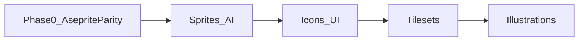

# Module Build Priority — PixelForge v1

**Status:** Locked for Phase 1–2 planning  
**Date:** 2026-06-18

Asset types are **equal in product vision** but **sequenced by dependency** for engineering. Phase 0 delivers full Aseprite parity (all types editable); this document ranks **AI-assisted workflows** and **asset-specific UX** after the editor core ships.

---

## Priority ranking

| Rank | Module | Phase | Rationale |
|------|--------|-------|-----------|
| **1** | **Sprites & characters** | Phase 1 | Highest user value; drives img2img (JPG/PNG→pixel), text→pixel, inpaint; smallest canvases = fastest iteration on RX 5600 XT |
| **2** | **Icons & UI** | Phase 1–2 | Shares sprite pipeline (16–32px, palette lock); adds 9-slice and button-state sets in Phase 2 |
| **3** | **Tilesets & environments** | Phase 2 | Depends on seamless-edge validation, tilemap layer parity (Phase 0), and test-map UX |
| **4** | **Illustrations / avatars** | Phase 2 | Larger canvases (128–256px); same AI stack but lower urgency vs game-ready sprites |

---

## Per-module v1 deliverables

### 1. Sprites & characters (P0)

| Feature | Phase | Notes |
|---------|-------|-------|
| Text → pixel sprite | 1 | 16–64px presets |
| JPG/PNG → pixel (img2img) | 1 | Primary conversion flow |
| Sketch → pixel from active cel | 1 | Editor layer as source |
| Inpaint / region regen | 1 | Selection mask |
| Pivot + collision metadata | 2 | Sidecar JSON |
| Direction sets (4/8-dir) | 3 | Tag-aware generation |

### 2. Icons & UI (P1)

| Feature | Phase | Notes |
|---------|-------|-------|
| Size presets 8/16/24/32px | 1 | Reuse sprite gen |
| Palette-locked icon batch | 2 | Style bible enforced |
| 9-slice panel generation | 2 | Slice tool parity required |
| Button state sets | 2 | Normal/hover/pressed/disabled |
| Cursor export 1x/2x | 2 | Export pipeline |

### 3. Tilesets & environments (P1)

| Feature | Phase | Notes |
|---------|-------|-------|
| Seamless tile generation | 2 | Edge-matching validator |
| Wang / autotile sets | 2 | 16-tile minimum |
| Tile test map | 2 | In-app mini level painter |
| Biome packs | 2 | Batch job queue |
| Parallax layers | 3 | Style-locked multi-layer |

### 4. Illustrations / avatars (P2)

| Feature | Phase | Notes |
|---------|-------|-------|
| Portrait presets | 2 | 64–128px |
| Background removal | 2 | Alpha mask post-process |
| Sticker/emote packs | 3 | Batch + collections |
| 256×256 pixel-clean | 2 | Longer ComfyUI runs |

---

## Build order diagram

---

## Cross-cutting dependencies

| Dependency | Blocks |
|------------|--------|
| ASE read/write + timeline | All modules |
| Tilemap layers (§2.8 parity) | Tileset module |
| Slice tool + 9-patch | UI module |
| ComfyUI img2img + quantize | Sprites, illustrations |
| Project palette + style bible | All AI modules |
| Server-side CLI export | Atlas / engine handoff |

---

## Success criteria per module

| Module | Metric |
|--------|--------|
| Sprites | JPG→32×32 in &lt;90s; 4 variants; round-trip `.aseprite` lossless |
| UI | 9-slice exports match Aseprite slice JSON |
| Tilesets | Seam validator passes on 16-tile grass set |
| Illustrations | 128×128 gen &lt;120s; palette drift &lt;2 colors vs style bible |

---

## Related documents

- [PRD](../PRD.md)
- [V1 scope decisions](./v1-scope.md)
- [Aseprite parity matrix](../specs/aseprite-parity-matrix.md)
