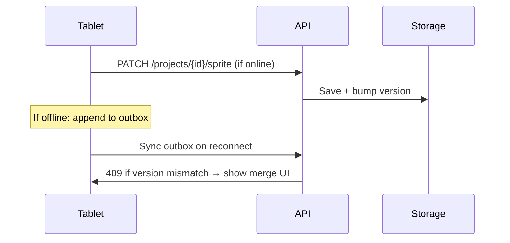

# V1 Scope Decisions — PixelForge

**Status:** Locked for PRD v1.0  
**Date:** 2026-06-18

Decisions for open items from the brainstorm (§13).

---

## Monetization

**Decision: No monetization in v1 — personal / self-hosted product.**

| Aspect | v1 choice |
|--------|-----------|
| Pricing | Free (open-core friendly; license TBD) |
| Accounts | Optional — works fully offline on tablet with local projects |
| Cloud SaaS | Not in v1 |
| Future | May add optional hosted sync tier in Phase 3; not blocking v1 |

**Rationale:** Primary user is the owner on MAZAYA-STUDIO + Advan tablet. No payment infrastructure needed for engineering kickoff.

---

## Auth & sync

**Decision: Lightweight account + offline-first sync with explicit conflict policy.**

### Auth (v1)

| Component | Choice |
|-----------|--------|
| Provider | **Self-hosted magic link** (same pattern as Doable homelab) |
| Social login | Not in v1 |
| Anonymous use | Allowed — local-only mode without account |
| Session | JWT in httpOnly cookie (web); secure storage (Android) |

### Sync model

| Layer | Behavior |
|-------|----------|
| **Projects** | Stored as `.aseprite` + sidecar `project.json` (palette, style bible, AI history) |
| **Offline tablet** | Full editor + local SQLite cache; queue mutations when backend unreachable |
| **PC offline** | Editor works; AI disabled; sync to backend still works if backend up |
| **Conflict resolution** | **Last-write-wins per asset** with version vector; user prompted only on simultaneous edit of same file |

### Sync flow

### Outbox (offline queue)

- Operations: save sprite, rename layer, AI job request (held until PC online)
- Max queue: 500 ops or 50 MB
- On conflict: show diff preview; user picks local vs remote vs duplicate as new file

---

## Parity baseline

**Decision: Pin to Aseprite v1.3.17.x stable** for parity tests. Track v1.3.18 betas as optional smoke tests.

---

## Backend hosting (v1)

| Service | Host |
|---------|------|
| App API + storage | Homelab VPS or homelab Docker (alongside existing stack) |
| Ollama + ComfyUI | MAZAYA-STUDIO (`100.89.170.66`) |
| Clients | Web browser + Android tablet (Advan Sketsa 3) |

---

## Related documents

- [PRD](../PRD.md)
- [Module priority](./module-priority.md)
- [Aseprite round-trip spec](../specs/aseprite-roundtrip.md)
